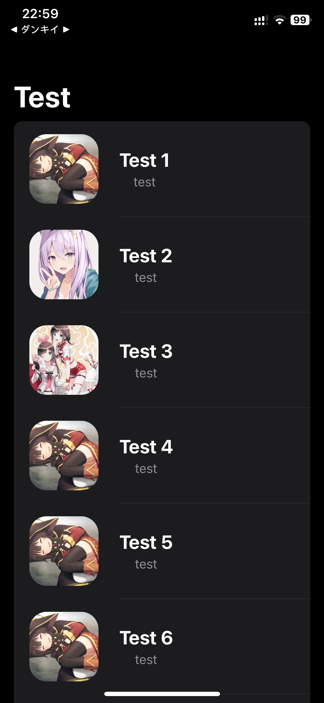

<h1>App Fetch API</h1>

This is an update of <a href="https://github.com/dunkeyyfong/FileJson">FileJson</a> in my Repositories. This update has the following features:

<ul>
  <li>Save caches</li>
  <li>Can fetch from file cache, don't use API to fetch</li>
  <li>Can automatic remove file cache if file cache for 1 day. (Can settings time remove file caches)</li>
</ul>

Picture code and app:

  
  

